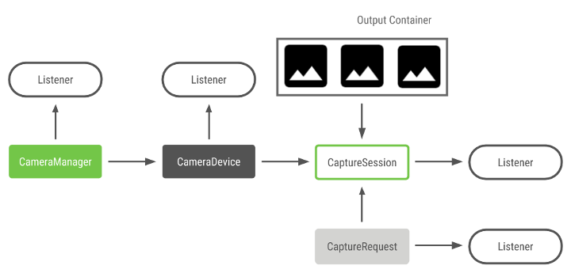
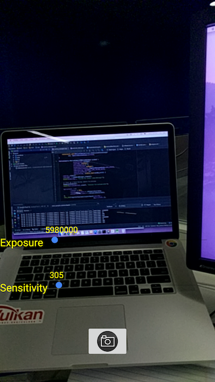

NdkCamera Sample
=============
Two API samples:
- texture-view:
Preview NDK camera image with [Android TextureView](https://developer.android.com/reference/android/view/TextureView.html)
- basic:
A basic NdkCamera sample to preview camera images with AReadImage and take jpeg photos.
Exposure and sensitivity are adjustable for preview, however capturing photos is in auto mode
(it could be adjustable with similar method as used for preview). 

Other Resources
---------------
- Getting familiar with the 5 Camera2 objects

- [Camera2 blogs](https://medium.com/androiddevelopers/camera-enumeration-on-android-9a053b910cb5)

- [Camera2 Java
  documentation](https://developer.android.com/reference/android/hardware/camera2/package-summary)

Pre-requisites
--------------
- Android Studio 2.3.0+ with [NDK-r15+](https://developer.android.com/ndk/) bundle
- Android device running android-24+

Getting Started
---------------
1. Download Android Studio from [latest stable release](http://developer.android.com/sdk/index.html) or [canary](http://tools.android.com/download/studio/canary)
1. Launch Android Studio
1. Select "Import project (Eclipse ADT, Gradle,etc)"
1. Browse into downloaded sample directory, select webp/build.gradle
1. Click *Tools/Android/Sync Project with Gradle Files*.
1. Click *Run/Run 'app'*.

Screenshots
-----------

Support
-------
If you've found an error in these samples, please [file an issue](https://github.com/googlesamples/android-ndk/issues/new).

Patches are encouraged, and may be submitted by [forking this project](https://github.com/googlesamples/android-ndk/fork) and
submitting a pull request through GitHub. Please see [CONTRIBUTING.md](../CONTRIBUTING.md) for more details.

For generic questions about Android Camera and other feedbacks, please go to

- [Stack Overflow](http://stackoverflow.com/questions/tagged/android-camera)
- [Android Tools Feedbacks](http://tools.android.com/feedback)

License
-------
Copyright 2015 Google, Inc.

Licensed to the Apache Software Foundation (ASF) under one or more contributor
license agreements.  See the NOTICE file distributed with this work for
additional information regarding copyright ownership.  The ASF licenses this
file to you under the Apache License, Version 2.0 (the "License"); you may not
use this file except in compliance with the License.  You may obtain a copy of
the License at

  http://www.apache.org/licenses/LICENSE-2.0

Unless required by applicable law or agreed to in writing, software
distributed under the License is distributed on an "AS IS" BASIS, WITHOUT
WARRANTIES OR CONDITIONS OF ANY KIND, either express or implied.  See the
License for the specific language governing permissions and limitations under
the License.
