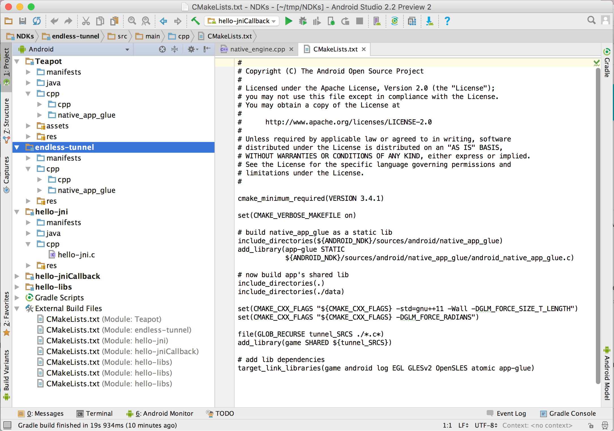

Android-CMake
=============

CMake sample includes 5 independent apps:    
- hello-jni
- hello-jniCallback
- hello-libs
- Teapot
- endless-tunnel
to demostrate android studio cmake plugin to build native (C/C++) project. Once the project is opened inside android studio 2.2 alpha5 or better(NOTE: 2.2 alpha4 will NOT work anymore), select anyone you are interested, then build and run on target.

Pre-requisites
--------------
- Android Studio 2.2+ on [canary](http://tools.android.com/download/studio/canary) with [NDK](https://github.com/android-ndk/ndk/wiki) bundle.

Screenshots
-----------

Support
-------
If you've found an error in these samples, please [file an issue](https://github.com/googlesamples/android-ndk/issues/new).

Patches are encouraged, and may be submitted by [forking this project](https://github.com/googlesamples/android-ndk/fork) and
submitting a pull request through GitHub. Please see [CONTRIBUTING.md](../CONTRIBUTING.md) for more details.

- [Stack Overflow](http://stackoverflow.com/questions/tagged/android-ndk)
- [Google+ Community](https://plus.google.com/communities/105153134372062985968)
- [Android Tools Feedbacks](http://tools.android.com/feedback)

License
-------

Copyright 2015 The Android Open Source Project, Inc.

Licensed to the Apache Software Foundation (ASF) under one or more contributor
license agreements.  See the NOTICE file distributed with this work for
additional information regarding copyright ownership.  The ASF licenses this
file to you under the Apache License, Version 2.0 (the "License"); you may not
use this file except in compliance with the License.  You may obtain a copy of
the License at

http://www.apache.org/licenses/LICENSE-2.0

Unless required by applicable law or agreed to in writing, software
distributed under the License is distributed on an "AS IS" BASIS, WITHOUT
WARRANTIES OR CONDITIONS OF ANY KIND, either express or implied.  See the
License for the specific language governing permissions and limitations under
the License.

[LICENSE](LICENSE)

[0]: https://developer.android.com/ndk
