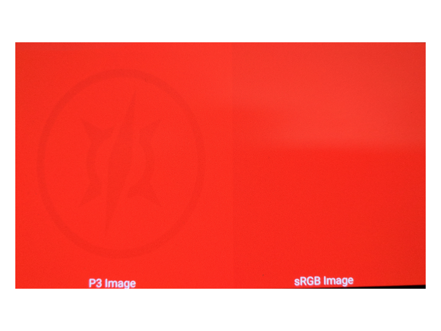

display-p3 ImageView Sample
==========================
A sample to view Display P3 images on Android devices. If Android OS and device both support display P3 mode, two versions of the image will be displayed:
- Display P3 view on the left hand side
- sRGB view on the right hand side

Pre-requisites
--------------
- [Android Oreo](https://developer.android.com/about/versions/oreo/index.html) (API level >= 26) device that supports wide color gamut mode
  (Implemented on Android Oreo with Display P3 color space)
- Android Studio 2.3+
- Android [NDK-r15+](https://developer.android.com/ndk/downloads/index.html)

Getting Started
---------------
1. [Download Android Studio](https://developer.android.com/studio/index.html)
1. [Download Android NDK-r15+](https://developer.android.com/ndk/downloads/index.html)
1. [Download source code](http://www.github.com/googlesamples/android-ndk)
1. Launch Android Studio.
1. "File"-->"New" --> "Import Project", select display-p3/build.gradle
1. "Run" --> "Run 'app'"

Screenshots
-----------


Description
-----------
This sample creates [Display P3](https://developer.android.com/about/versions/oreo/android-8.0.html#cm)
EGLContext_, then creates 2 textures for each PNG file under "assets" folder: the first is in Display P3 image mode,
the second is in sRGB mode. The sRGB texture is created by transforming the 
original Display P3 image into CIExyz 1931 color space, clamping colors in
sRGB color space, then transforming it back to Display P3 color space to display.

The Display P3 mode is turned on when application requests a window surface of type
`EGL_GL_COLORSPACE_DISPLAY_P3_EXT`:
```java
  std::vector<EGLint> attributes;
  attributes.push_back(EGL_GL_COLORSPACE_KHR);
  attributes.push_back(EGL_GL_COLORSPACE_DISPLAY_P3_EXT);
  attributes.push_back(EGL_NONE);
  engine->surface_ = eglCreateWindowSurface(
      engine->display_, config, engine->app->window, attributes.data());

```
All images under the assets folder are *assumed* to be already encoded in Display P3 color
space:
- gamma value : 2.2
- Display P3 color space with D65 as white reference point

To add new images, simply drop the new file into this folder. 

Changing display_ mode:
- Tap on image to show/hide (Display P3 mode or sRGB mode)
- Swipe up/down to rotate through image files

More About Wide Color Gamut
- [Color Management in Android Oreo](https://developer.android.com/about/versions/oreo/android-8.0.html#cm)
- [Understanding Color (talk at Google I/O 2017)](https://www.youtube.com/watch?v=r8NeG0wmFXM)
- [Enhancing Graphics with Wide Color Content](https://developer.android.com/training/wide-color-gamut/index.html)

Version History
---------------
| Version   |  Date    |    Note                          |
| --------- | -------- | ---------------------------------|
|    1.0    | 07/2017  |    Initial Version               |


License
-------
Copyright 2017 Google, Inc.

Licensed to the Apache Software Foundation (ASF) under one or more contributor
license agreements.  See the NOTICE file distributed with this work for
additional information regarding copyright ownership.  The ASF licenses this
file to you under the Apache License, Version 2.0 (the "License"); you may not
use this file except in compliance with the License.  You may obtain a copy of
the License at

http://www.apache.org/licenses/LICENSE-2.0

Unless required by applicable law or agreed to in writing, software
distributed under the License is distributed on an "AS IS" BASIS, WITHOUT
WARRANTIES OR CONDITIONS OF ANY KIND, either express or implied.  See the
License for the specific language governing permissions and limitations under
the License.

