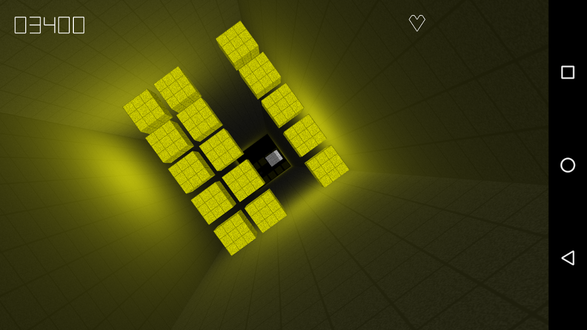

Endless Tunnel
==============
Endless Tunnel is a sample game that shows how to:
- use the Android Studio C++ support
- implement a game using Android native glue
- implement joystick support, including robust DPAD navigation for non-touch screens

It is NOT the goal of this sample to show the best way to write the
game logic, load resources, etc. The game itself was intentionally
kept rudimentary in order to keep the focus on the Android Studio C++
integration. For example, this game contains textures and geometry
hard-coded in code, which works for small demo games like this one,
but doesn't scale well to real games.

This sample uses the new [Gradle Experimental Android plugin](http://tools.android.com/tech-docs/new-build-system/gradle-experimental) with C++ support.

Pre-requisites
--------------
- Android Studio 2.2+ with [NDK](https://developer.android.com/ndk/) bundle.

Getting Started
---------------
1. [Download Android Studio](http://developer.android.com/sdk/index.html)
1. Launch Android Studio.
1. Open the sample directory.
1. Open *File/Project Structure...*
  - Click *Download* or *Select NDK location*.
1. Click *Tools/Android/Sync Project with Gradle Files*.
1. Click *Run/Run 'app'*.

Screenshots
-----------


Dependencies
------------
### GLM LIBRARY

This project uses the OpenGL Mathematics (GLM) library, available at:

    http://glm.g-truc.net/

For more information about this library and its license, please see
Tunnel/jni/glm/readme.txt and Tunnel/jni/glm/copying.txt.

Acknowledgements
----------------
Most of this code was written by [Bruno Oliveira](https://plus.google.com/+BrunoOliveira).

Walkthrough
-----------
Source code is under app, it only contains C++ code, which is
sitting at its default location (same as for other samples) at
app/jni.

The game starts at the android_main function in 
jni/engine/native-activity.app, like any standard NDK game.

### Scenes And The Scene Manager

We have a singleton class called SceneManager. As the name says, it's
the class that manages scenes. There's always an active Scene, and
the scene determines what's visible onscreen and how the game reacts
to input. The main menu is a scene, the gameplay is another scene.

As the game runs, the display might be initialized and terminated
multiple times, corresponding, for example, to the app losing focus
and being brought back into focus. This is why the SceneManager
(and the Scene's) have the notion of StartGraphics() and KillGraphics().
These two methods may be called multiple times along the lifetime of
a scene. So everything that has to do with graphics context (like
shaders, textures, etc) has to be initialized in StartGraphics(), 
and has to be torn down in KillGraphics().

The engine_init_display function is where we set up OpenGL
for our game, and call StartGraphics() on the active scene.
The engine_term_display is where we call KillGraphics() on the active
scene.

Input arrives by way of the engine_handle_input function, which
does some basic input classification and delivers the input to
the scene manager. Incidentally, here we also synthesise DPAD events based
on the joystick hat axes (many game controllers generate hat events
when you press the directional pad), because that way we can use that
directional pad to drive UI navigation in the main screen.

While we're in jni/engine, take a look at scene_manager.cpp,
scene.cpp, etc to familiarize yourself with them.

### Geometry And Rendering

The game's geometry is represented by VBOs and IBOs. A VBO is represented
by the VertexBuf class, and an IBO is represented by an IndexBuf.
A shader is represented by the Shader class, of which TrivialShader is
a concrete example.

Now, onto rendering. Everything in the game is rendered by a Shader.

Normally, to use a Shader, you call BeginRender() and give it a
VertexBuf. This means you will be rendering one or more subsets of that
geometry. After that, call Render(ibuf, mat) where ibuf is the IndexBuffer
that represents the part of the geometry you want to render, and
mat is the transformation matrix. You can call Render() multiple times to
render different subsets of the geometry with different matrices.
When you're done, you call the shader's EndRender() method.

As a simpler alternative when you only want to render a single copy
of an object that's defined by a VertexBuffer and IndexBuffer pair,
just call RenderSimpleGeom(), which takes a matrix and a SimpleGeom
object (which, in turn, is just a pair of VertexBuffer and IndexBuffer).

The shader subclass is responsible for knowing what to do to render
a geometry. For example, if the shader needs texture coordinates, it will
query the geometry for texture coordinates as necessary -- if it doesn't
have them, it will throw an error (that being just an euphemism for
an ugly native crash). So, yes, you have to be careful that the geometry
you're feeding to a shader has the data that's needed by that shader.

Particularly, TrivialShader only needs position and color info for 
each vertex. The more complex OurShader class (in jni/our_shader.cpp)
needs texture coordinates.

### The Normalized 2d Coord System

For all 2D rendering, we use a normalized coordinate system where
the bottom-left of the screen is (0,0), the X coordinate increases
to the right and the Y coordinate increases upwards. The Y coordinate
of the top of the screen is defined to be 1.0. The X coordinate of
the right side of the screen is the screen's aspect ratio. So,
on a 4:3 screen, these are the coordinates of the four corners
of the screen:

```
(0.000,1.000)       (1.333,1.000)
       +--------------+
       |              |
       |              |
       |              |
       |              |
       +--------------+
(0.000,0.000)       (1.333,0.000)
```

What this means is that Y=0.5 is always the vertical center of the
screen regardless of the screen size, and that X=aspect/2 is always
the horizontal center of the screen, regardless of physical screen size.

This coordinate system is set up like this:

```
    glm::mat4 modelMat, mat;

    // set up projection matrix
    float aspect = SceneManager::GetInstance()->GetScreenAspect();
    glm::mat4 orthoMat = glm::ortho(0.0f, aspect, 0.0f, 1.0f);

    // ... (set up modelMat as needed)

    // determine final matrix for rendering
    mat = orthoMat * modelMat;

    // render something
    mShader->RenderSimpleGeom(&mat, mGeom);
```

### The Main Menu

The game's main menu scene is in jni/welcome_scene.cpp. It renders
all the buttons on the interface and manages the navigation. It can
also show popups ("About", "Story", "Play").

### Game Logic

The whole game logic is contained in the PlayScene class. We won't dive
into a full discussion of it, but start reading from the DoFrame() method
and it should become clear. It's a standard game loop that handles
input, updates the world, checks for collisions and renders.

Support
-------
If you've found an error in these samples, please [file an issue](https://github.com/googlesamples/android-ndk/issues/new).

Patches are encouraged, and may be submitted by [forking this project](https://github.com/googlesamples/android-ndk/fork) and
submitting a pull request through GitHub. Please see [CONTRIBUTING.md](../CONTRIBUTING.md) for more details.

- [Stack Overflow](http://stackoverflow.com/questions/tagged/android-ndk)
- [Google+ Community](https://plus.google.com/communities/105153134372062985968)
- [Android Tools Feedbacks](http://tools.android.com/feedback)

License
-------
Copyright 2015 Google, Inc.

Licensed to the Apache Software Foundation (ASF) under one or more contributor
license agreements.  See the NOTICE file distributed with this work for
additional information regarding copyright ownership.  The ASF licenses this
file to you under the Apache License, Version 2.0 (the "License"); you may not
use this file except in compliance with the License.  You may obtain a copy of
the License at

  http://www.apache.org/licenses/LICENSE-2.0

Unless required by applicable law or agreed to in writing, software
distributed under the License is distributed on an "AS IS" BASIS, WITHOUT
WARRANTIES OR CONDITIONS OF ANY KIND, either express or implied.  See the
License for the specific language governing permissions and limitations under
the License.
