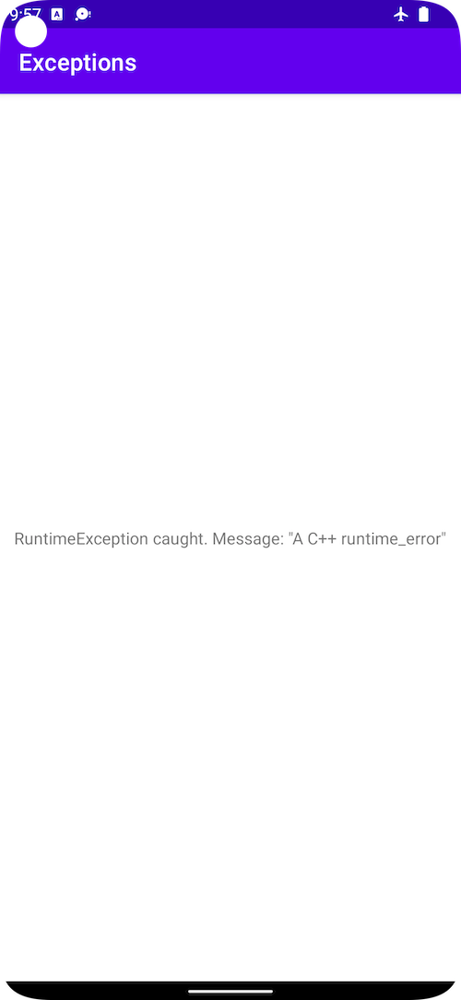

# Exceptions

This Android sample shows how to handle exceptions across the JNI boundary.

## Handling native exceptions

Native exceptions can be caught in JNI methods and re-thrown in the JVM. Because
uncaught native exceptions will cause your app to crash, we recommend catching
**all** exceptions as a fail-safe. You may also want to catch instances of
`std::exception` or your own exception interface:

```C++
extern "C" JNIEXPORT void JNICALL
Java_com_example_exceptions_MainActivity_throwsException(JNIEnv* env,
                                                         jobject /* this */) {
  try {
    might_throw();
  } catch (std::exception& e) {
    jniThrowRuntimeException(env, e.what());
  } catch (...) {
    jniThrowRuntimeException(env, "Catch-all");
  }
}
```

Then, you can do the same in your Java/Kotlin code:

```kotlin
    try {
        jniMethodThatMightThrow();
    } catch (e: java.lang.RuntimeException) {
        // Handle exception
    }
```

The hard part here is using the JNI API to throw an exception in the JVM. That
is, implementing `jniThrowRuntimeException`. We recommend referring to
[JNIHelp.h](https://android.googlesource.com/platform/libnativehelper/+/refs/heads/master/include/nativehelper/JNIHelp.h)
and
[JNIHelp.c](https://android.googlesource.com/platform/libnativehelper/+/refs/heads/master/JNIHelp.c)
in the Android platform's libnativehelper, from which
[exception_helper.h](exceptions/app/src/main/cpp/exception_helper.h) and
[exception_helper.cpp](exceptions/app/src/main/cpp/exception_helper.cpp) are
adapted.

## Screenshot



## Support

If you've found an error in these samples, please
[file an issue](https://github.com/googlesamples/android-ndk/issues/new).

Patches are encouraged, and may be submitted by
[forking this project](https://github.com/googlesamples/android-ndk/fork) and
submitting a pull request through GitHub. Please see
[CONTRIBUTING.md](../CONTRIBUTING.md) for more details.

- [Stack Overflow](http://stackoverflow.com/questions/tagged/android-ndk)
- [Android Tools Feedbacks](http://tools.android.com/feedback)

## License

Copyright 2022 Google, Inc.

Licensed to the Apache Software Foundation (ASF) under one or more contributor
license agreements. See the NOTICE file distributed with this work for
additional information regarding copyright ownership. The ASF licenses this file
to you under the Apache License, Version 2.0 (the "License"); you may not use
this file except in compliance with the License. You may obtain a copy of the
License at

http://www.apache.org/licenses/LICENSE-2.0

Unless required by applicable law or agreed to in writing, software distributed
under the License is distributed on an "AS IS" BASIS, WITHOUT WARRANTIES OR
CONDITIONS OF ANY KIND, either express or implied. See the License for the
specific language governing permissions and limitations under the License.
