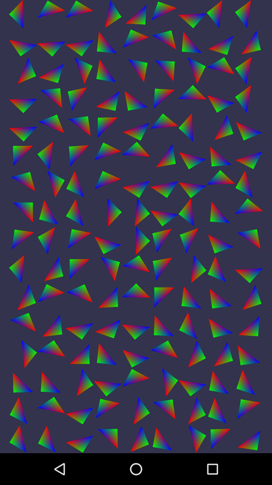

gles3jni
=========
gles3jni is an Android C++ sample that demonstrates how to use OpenGL ES 3.0 from JNI/native code.

The OpenGL ES 3.0 rendering path uses a few new features compared to the
OpenGL ES 2.0 path:
- Instanced rendering and vertex attribute divisor to reduce the number of
  draw calls and uniform changes.
- Vertex array objects to reduce the number of calls required to set up
  vertex attribute state on each frame.
- Explicit assignment of attribute locations, eliminating the need to query
  assignments.

This sample uses the new [Android Studio CMake plugin](http://tools.android.com/tech-docs/external-c-builds) with C++ support.

Pre-requisites
--------------
- Android Studio 1.3+ with [NDK](https://developer.android.com/ndk/) bundle.

Getting Started
---------------
1. [Download Android Studio](http://developer.android.com/sdk/index.html)
1. Launch Android Studio.
1. Open the sample directory.
1. Open *File/Project Structure...*
  - Click *Download* or *Select NDK location*.
1. Click *Tools/Android/Sync Project with Gradle Files*.
1. Click *Run/Run 'app'*.

Screenshots
-----------

Support
-------
If you've found an error in these samples, please [file an issue](https://github.com/googlesamples/android-ndk/issues/new).

Patches are encouraged, and may be submitted by [forking this project](https://github.com/googlesamples/android-ndk/fork) and
submitting a pull request through GitHub. Please see [CONTRIBUTING.md](../CONTRIBUTING.md) for more details.

- [Stack Overflow](http://stackoverflow.com/questions/tagged/android-ndk)
- [Android Tools Feedbacks](http://tools.android.com/feedback)

License
-------
Copyright 2015 Google, Inc.

Licensed to the Apache Software Foundation (ASF) under one or more contributor
license agreements.  See the NOTICE file distributed with this work for
additional information regarding copyright ownership.  The ASF licenses this
file to you under the Apache License, Version 2.0 (the "License"); you may not
use this file except in compliance with the License.  You may obtain a copy of
the License at

  http://www.apache.org/licenses/LICENSE-2.0

Unless required by applicable law or agreed to in writing, software
distributed under the License is distributed on an "AS IS" BASIS, WITHOUT
WARRANTIES OR CONDITIONS OF ANY KIND, either express or implied.  See the
License for the specific language governing permissions and limitations under
the License.
