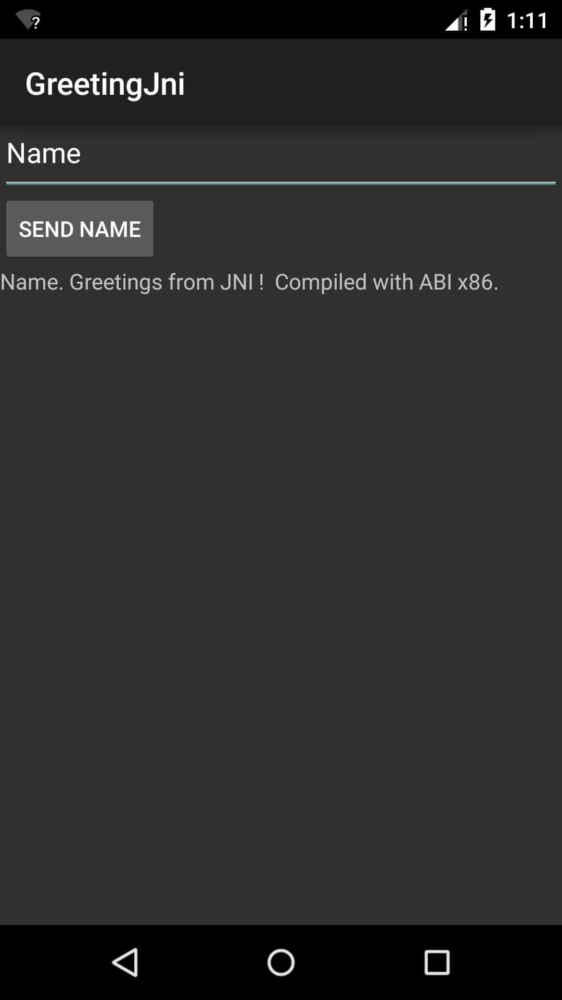

Greeting JNI
=========
Greeting JNI is an Android sample that uses JNI to call C code from a Android Java Activity.
This is based on HelloJNI as a simple example to show the use of Unit Tests in your NDK projects.

Pre-requisites
--------------
- Android Studio 1.3+ with [NDK](https://developer.android.com/ndk/) bundle.

Getting Started
---------------
1. [Download Android Studio](http://developer.android.com/sdk/index.html)
1. Launch Android Studio.
1. Open the sample directory.
1. Open *File/Project Structure...*
  - Click *Download* or *Select NDK location*.
1. Click *Tools/Android/Sync Project with Gradle Files*.
1. Click *Run/Run 'app'*.

Screenshots
-----------

Instrumentation Tests (Espresso)
-------
Greeting JNI contains a sample tests that run the JNI code using the AndroidJUnit4 Instrumentation Runner.
Use the following steps to run/debug the Instrumentations Tests:

1. Using Android Studio in the *Build Variants/Test Artifacts* be sure to have *Android Instrumentations Tests* selected.
    - If you're working on a recent version of Android Studio the IDE will run both unit test artifacts by default.
1. Create an Android Tests Run/Debug configuration.
1. Please set the *AndroidJUnitRunner* in the *Specific instrumentation runner*.
  - It says *optional* but I found that it doesn't run if its not selected.
1. Click *Apply*, and *Run/Debug* the tests.

Please read the following documentation for more information:

- [Android Testing Samples](https://github.com/googlesamples/android-testing)
- [Testing Fundamentals](http://developer.android.com/tools/testing/testing_android.html)
- [InstrumentationTestRunner](http://developer.android.com/reference/android/test/InstrumentationTestRunner.html)

Support
-------
If you've found an error in these samples, please [file an issue](https://github.com/googlesamples/android-ndk/issues/new).

Patches are encouraged, and may be submitted by [forking this project](https://github.com/googlesamples/android-ndk/fork) and
submitting a pull request through GitHub. Please see [CONTRIBUTING.md](CONTRIBUTING.md) for more details.

- [Stack Overflow](http://stackoverflow.com/questions/tagged/android-ndk)
- [Google+ Community](https://plus.google.com/communities/105153134372062985968)
- [Android Tools Feedback](http://tools.android.com/feedback)

License
-------
Copyright 2015 Google, Inc.

Licensed to the Apache Software Foundation (ASF) under one or more contributor
license agreements.  See the NOTICE file distributed with this work for
additional information regarding copyright ownership.  The ASF licenses this
file to you under the Apache License, Version 2.0 (the "License"); you may not
use this file except in compliance with the License.  You may obtain a copy of
the License at

  http://www.apache.org/licenses/LICENSE-2.0

Unless required by applicable law or agreed to in writing, software
distributed under the License is distributed on an "AS IS" BASIS, WITHOUT
WARRANTIES OR CONDITIONS OF ANY KIND, either express or implied.  See the
License for the specific language governing permissions and limitations under
the License.
