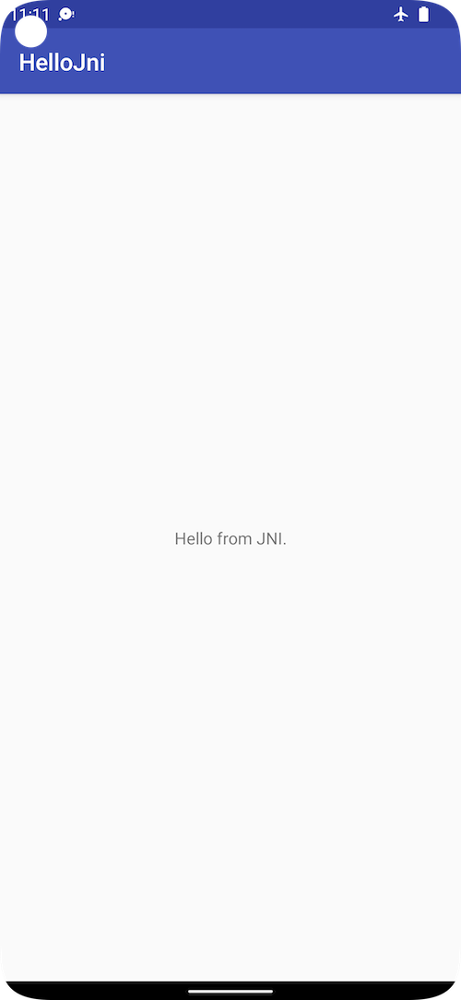

Hello JNI
=========
This sample shows how to call Native C++ code from a Android Java Activity using JNI. Note this requires a preview build of Android Studio and the experimental version Android Gradle plugin, see the [Pre-requisites](#pre-requisites) and [Getting Started](#getting-started) instructions.

Pre-requisites
--------------

- [Android NDK](https://developer.android.com/ndk/)
- Android Studio 1.3 Preview from the [canary channel](http://tools.android.com/download/studio/canary)
- Experimental version of Android Plugin for Gradle [build from sources](http://tools.android.com/build/gradleplugin).

Getting Started
---------------

1. [Download](http://tools.android.com/download/studio/canary) or [switch](http://tools.android.com/download/studio/canary) to Android Studio canary channel.
1. Follow [instructions](http://tools.android.com/build/gradleplugin) to build the experimental version of the Android Plugin for Gradle.
1. Launch Android Studio.
1. Open `android-ndk/hello-jni` sample.
1. Open *File/Project Structure...*
  1. Click *Download* or *Select NDK location*.
1. Click *Tools/Android/Sync Project with Gradle Files*.
1. Click *Run/Run 'app'*.

Screenshots
-----------

Support
-------

If you've found an error in these samples, please [file an issue](https://github.com/googlesamples/android-ndk/issues/new).

Patches are encouraged, and may be submitted by [forking this project](https://github.com/googlesamples/android-ndk/fork) and
submitting a pull request through GitHub. Please see [CONTRIBUTING.md](CONTRIBUTING.md) for more details.

- [Stack Overflow](http://stackoverflow.com/questions/tagged/android-ndk)
- [Google+ Community](https://plus.google.com/communities/105153134372062985968)
- [Android Tools Feedbacks](http://tools.android.com/feedback)

License
-------

Copyright 2015 Google, Inc.

Licensed to the Apache Software Foundation (ASF) under one or more contributor
license agreements.  See the NOTICE file distributed with this work for
additional information regarding copyright ownership.  The ASF licenses this
file to you under the Apache License, Version 2.0 (the "License"); you may not
use this file except in compliance with the License.  You may obtain a copy of
the License at

  http://www.apache.org/licenses/LICENSE-2.0

Unless required by applicable law or agreed to in writing, software
distributed under the License is distributed on an "AS IS" BASIS, WITHOUT
WARRANTIES OR CONDITIONS OF ANY KIND, either express or implied.  See the
License for the specific language governing permissions and limitations under
the License.
