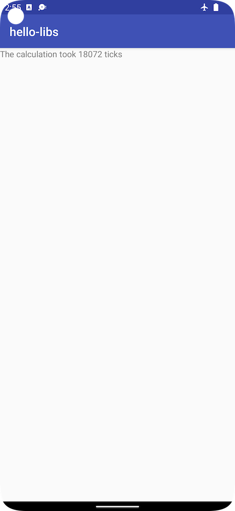

hello-libs
=========
hello-libs is a sample that shows you how to manage 3rd party C/C++ libraries with Android Studio.

Introduction
------------
This sample uses the [Android Studio CMake plugin](http://tools.android.com/tech-docs/external-c-builds) with external library support. It demos how to:

* include a pre-built static library (gmath) in your app
* include a pre-built shared library (gperf) in your app

Description
-----------
The sample includes 2 modules:
*    app -- imports a shared library (libgperf.so) and a static library (libgmath.a) from the `distribution` folder
*    gen-libs -- contains the source code and CMake build script for the gmath and gperf example libraries. The resulting binaries are copied into the `distribution` folder. By default, gen-libs module is disabled in setting.gradle and app/build.gradle, so it won't show up in Android Studio IDE. If re-generating lib is desirable, follow comments inside settings.gradle and app/build.gradle to enable this module, generate libs, then disable it again to avoid unnecessary confusion.

The main goal of the sample is to demo how to use 3rd party libs, it is not to demonstrate lib package generation. Toward that goal, the pre-built libs are included in the `distribution` folder.

When importing libraries into your app, include the following in your app's `CMakeLists.txt` file (in the following order): 

*    import libraries as static or shared(using `add_library`)
*    configure each library binary location(using `set_target_properties`)
*    configure each library headers location (using `target_include_directories`)

If you are using Android Gradle Plugin than version 4.0.0,
for shared libraries, you need to explicitly notify gradle to pack them into APK.
One simple way is to include the shared lib directory into application's jniLibs directory:
*    jniLibs.srcDirs = ['../distribution/gperf/lib']

Pre-requisites
--------------
- Android Studio 3.0.0 with [NDK](https://developer.android.com/ndk/) bundle.

Getting Started
---------------
1. [Download Android Studio](http://developer.android.com/sdk/index.html)
1. Launch Android Studio.
1. Open the sample directory.
1. Open *File/Project Structure...*
  - Click *Download* or *Select NDK location*.
1. Click *Tools/Android/Sync Project with Gradle Files*.
1. Click *Run/Run 'app'*.

Screenshots
-----------

Support
-------
If you've found an error in these samples, please [file an issue](https://github.com/googlesamples/android-ndk/issues/new).

Patches are encouraged, and may be submitted by [forking this project](https://github.com/googlesamples/android-ndk/fork) and
submitting a pull request through GitHub. Please see [CONTRIBUTING.md](../CONTRIBUTING.md) for more details.

- [Stack Overflow](http://stackoverflow.com/questions/tagged/android-ndk)
- [Android Tools Feedbacks](http://tools.android.com/feedback)

License
-------
Copyright 2015 Google, Inc.

Licensed to the Apache Software Foundation (ASF) under one or more contributor
license agreements.  See the NOTICE file distributed with this work for
additional information regarding copyright ownership.  The ASF licenses this
file to you under the Apache License, Version 2.0 (the "License"); you may not
use this file except in compliance with the License.  You may obtain a copy of
the License at

  http://www.apache.org/licenses/LICENSE-2.0

Unless required by applicable law or agreed to in writing, software
distributed under the License is distributed on an "AS IS" BASIS, WITHOUT
WARRANTIES OR CONDITIONS OF ANY KIND, either express or implied.  See the
License for the specific language governing permissions and limitations under
the License.

 
