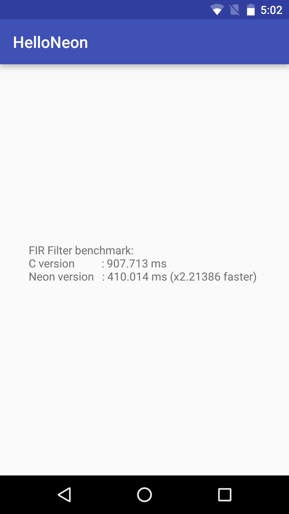

Hello Neon
==========
Hello Neon is an Android sample that uses ARM NEON for fir filter implementation:
- identify NEON files in source tree, they would be just normal c/c++ source files
- append -mfpu=neon to CMake compile flag for neon source files.
This is different from android.mk, in that:
- *.c.neon is fake file name; cmake does not need that mechanism

If there are lot of NEON files in the project, make a NEON lib:
- turn NEON compile flags for the lib
- let the rest of the project use the NEON libs
(this approach is not shown)

This sample uses the new [Android Studio CMake plugin](http://tools.android.com/tech-docs/external-c-builds) with C++ support.

Pre-requisites
--------------
- Android Studio 2.2+ with [NDK](https://developer.android.com/ndk/) bundle.

Getting Started
---------------
1. [Download Android Studio](http://developer.android.com/sdk/index.html)
1. Launch Android Studio.
1. Open the sample directory.
1. Open *File/Project Structure...*, then click *Download* or *Select NDK location*.
1. Click *Build/Generate Signed APK* to [build release APK](https://developer.android.com/studio/publish/app-signing.html#sign-apk).
1. Install your signed APK with *adb install -r your-signed-apk*.
1. Run it on your target device

Notes:
- Build for release version(signed APK will do that) to view the performance numbers
- The performance number may vary with different platforms
- On x86 platforms, the purpose is to demo the neon code portability: neon performance number may not be better than that of the "C" version

Screenshots
-----------

Support
-------
If you've found an error in these samples, please [file an issue](https://github.com/googlesamples/android-ndk/issues/new).

Patches are encouraged, and may be submitted by [forking this project](https://github.com/googlesamples/android-ndk/fork) and
submitting a pull request through GitHub. Please see [CONTRIBUTING.md](../CONTRIBUTING.md) for more details.

- [Stack Overflow](http://stackoverflow.com/questions/tagged/android-ndk)
- [Android Tools Feedbacks](http://tools.android.com/feedback)

License
-------
Copyright 2015 Google, Inc.

Licensed to the Apache Software Foundation (ASF) under one or more contributor
license agreements.  See the NOTICE file distributed with this work for
additional information regarding copyright ownership.  The ASF licenses this
file to you under the Apache License, Version 2.0 (the "License"); you may not
use this file except in compliance with the License.  You may obtain a copy of
the License at

  http://www.apache.org/licenses/LICENSE-2.0

Unless required by applicable law or agreed to in writing, software
distributed under the License is distributed on an "AS IS" BASIS, WITHOUT
WARRANTIES OR CONDITIONS OF ANY KIND, either express or implied.  See the
License for the specific language governing permissions and limitations under
the License.
