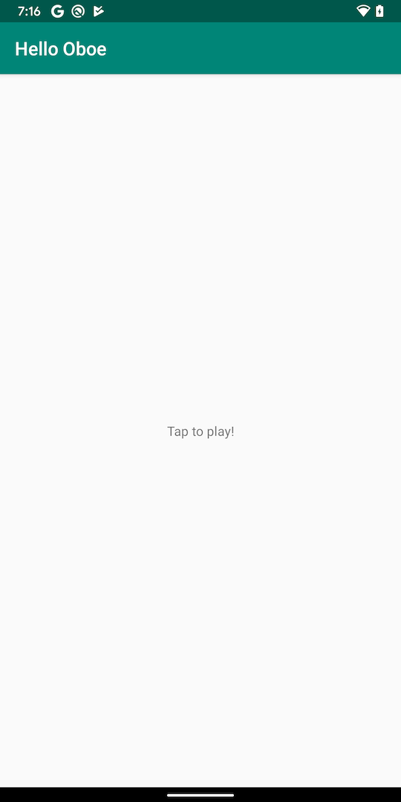

Hello Oboe
=========
Hello Oboe is an Android sample that uses the
[Oboe](https://github.com/google/oboe) library to play audio natively. Oboe
wraps both AAudio and OpenSLES to help developers play and record audio in
performance sensitive contexts across Android versions. The Oboe
repository has more information about how to fully take advantage of the Oboe API,
as well as more in-depth examples and documentation.

This sample uses the Studio Prefab feature to download pre-built Oboe library from [Google Maven](https://maven.google.com/web/index.html),
feel free to checkout Prefab steps in
- gradle.properties
- app/build.gradle
- app/src/main/cpp/CMakeLists.txt
 
If you like to build your app with the Oboe library source code, refer to the examples in the Oboe
repository.

Pre-requisites
--------------
- Android Studio 4.0+ with [NDK](https://developer.android.com/ndk/) bundle.

Getting Started
---------------
1. [Download Android Studio](http://developer.android.com/sdk/index.html)
1. Launch Android Studio.
1. Open the sample directory.
1. Open *File/Project Structure...*
  - Click *Download* or *Select NDK location*.
1. Click *Tools/Android/Sync Project with Gradle Files*.
1. Click *Run/Run 'app'*.

Screenshot
------------

Using the App
--------------
Tap and hold the screen to play audio. The app will render a 440Hz sine wave
while the screen is being pressed.

Support
-------
If you've found an error in these samples, please [file an issue](https://github.com/googlesamples/android-ndk/issues/new).

Patches are encouraged, and may be submitted by [forking this project](https://github.com/googlesamples/android-ndk/fork) and
submitting a pull request through GitHub. Please see [CONTRIBUTING.md](../CONTRIBUTING.md) for more details.

- [Stack Overflow](http://stackoverflow.com/questions/tagged/android-ndk)
- [Android Tools Feedbacks](http://tools.android.com/feedback)

License
-------
Copyright 2019 Google, Inc.

Licensed to the Apache Software Foundation (ASF) under one or more contributor
license agreements.  See the NOTICE file distributed with this work for
additional information regarding copyright ownership.  The ASF licenses this
file to you under the Apache License, Version 2.0 (the "License"); you may not
use this file except in compliance with the License.  You may obtain a copy of
the License at

  http://www.apache.org/licenses/LICENSE-2.0

Unless required by applicable law or agreed to in writing, software
distributed under the License is distributed on an "AS IS" BASIS, WITHOUT
WARRANTIES OR CONDITIONS OF ANY KIND, either express or implied.  See the
License for the specific language governing permissions and limitations under
the License.
