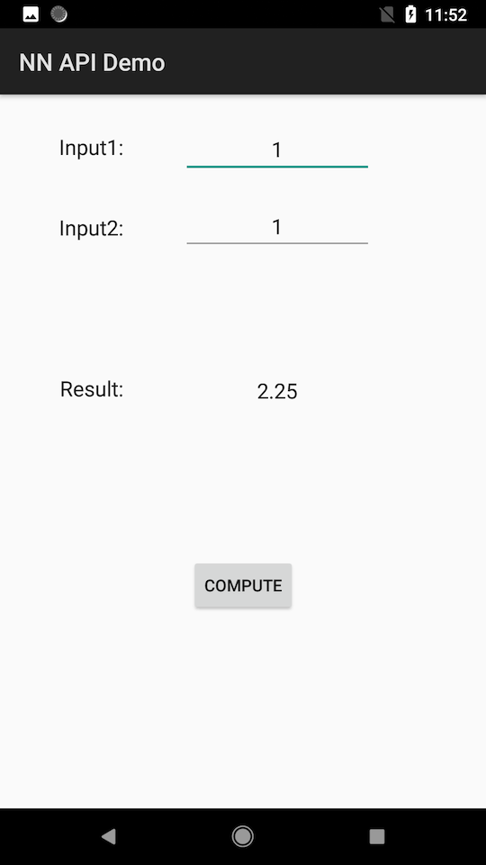

Android Neural Networks API Sample
======
Android Neural Networks API (NN API) Sample demonstrates basic usages of NN API with a simple model that consists of three operations: two additions and a multiplication.

The sums created by the additions are the inputs to the multiplication. In essence, we are creating a graph that computes: (tensor0 + tensor1) * (tensor2 + tensor3).
```java
tensor0 ---+
           +--- ADD ---> intermediateOutput0 ---+
tensor1 ---+                                    |
                                                +--- MUL---> output
tensor2 ---+                                    |
           +--- ADD ---> intermediateOutput1 ---+
tensor3 ---+
```

Two of the four tensors, tensor0 and tensor2 being added are constants, defined in the model. They represent the weights that would have been learned during a training process, loaded from model_data.bin.

The other two tensors, tensor1 and tensor3 will be inputs to the model. Their values will be provided when we execute the model. These values can change from execution to execution.

Besides the two input tensors, an optional fused activation function can also be defined for ADD and MUL. In this example, we'll simply set it to NONE.

The model then has 8 operands:
- 2 tensors that are inputs to the model. These are fed to the two ADD operations.
- 2 constant tensors that are the other two inputs to the ADD operations.
- 1 fuse activation operand reused for the ADD operations and the MUL operation.
- 2 intermediate tensors, representing outputs of the ADD operations and inputs to the MUL operation.
- 1 model output.

Pre-requisites
--------------
- Android Studio 3.0+.
- NDK r16+.
- Android API 27+.

Getting Started
---------------
1. [Download Android Studio](http://developer.android.com/sdk/index.html)
1. Launch Android Studio.
1. Open the sample directory.
1. Click *Tools/Android/Sync Project with Gradle Files*.
1. Click *Run/Run 'app'*.

Screenshots
-----------


Support
-------
If you've found an error in these samples, please [file an issue](https://github.com/googlesamples/android-ndk/issues/new).

Patches are encouraged, and may be submitted by [forking this project](https://github.com/googlesamples/android-ndk/fork) and
submitting a pull request through GitHub. Please see [CONTRIBUTING.md](../CONTRIBUTING.md) for more details.

- [Stack Overflow](http://stackoverflow.com/questions/tagged/android-ndk)
- [Google+ Community](https://plus.google.com/communities/105153134372062985968)
- [Android Tools Feedbacks](http://tools.android.com/feedback)

License
-------
Copyright 2017 Google, Inc.

Licensed to the Apache Software Foundation (ASF) under one or more contributor
license agreements.  See the NOTICE file distributed with this work for
additional information regarding copyright ownership.  The ASF licenses this
file to you under the Apache License, Version 2.0 (the "License"); you may not
use this file except in compliance with the License.  You may obtain a copy of
the License at

  http://www.apache.org/licenses/LICENSE-2.0

Unless required by applicable law or agreed to in writing, software
distributed under the License is distributed on an "AS IS" BASIS, WITHOUT
WARRANTIES OR CONDITIONS OF ANY KIND, either express or implied.  See the
License for the specific language governing permissions and limitations under
the License.
