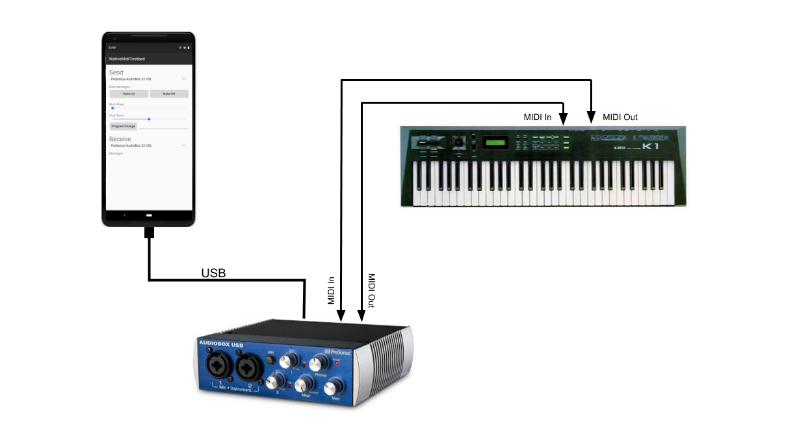
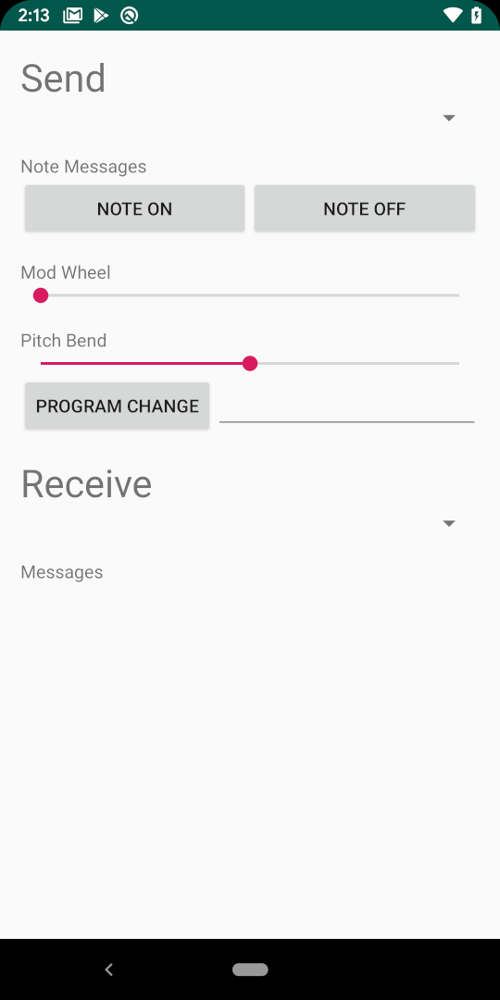

Description
-----------
### Introduction
The Native MIDI sample is a simple Android application which demonstrates how to use [the Android Native MIDI API](http://developer.android.com/preview/features/midi), a new feature in Android 29.

Note that [AMidi](http://developer.android.com/preview/features/midi) is a simple data transport mechanism. It works in terms of streams of bytes and does not impose any MIDI semantics beyond that whole MIDI messages are transported as a unit. Indeed, basic MIDI constructs such as message IDs, or message formatting are not represented in either API. However, since the sample does deal with MIDI semantics, there are definitions and mechanism to support these semantics.

### An Important Nomenclature Observation
AMidi inherits most of its terminology from the existing Android Java MIDI API. This can cause confusion regarding the naming of port types and their directionality. The Android Java MIDI API regards the directionality of the ports from the perspective of the connected MIDI peripheral, not the perspective of the application. AMidi inherits this perspective so an application uses an AMidiOutputPort to receive MIDI data from the output port of a device and uses an AMidiInputPort to send data to the input port of a device. AMidi uses the verbs “send” and “receive” to make this more clear to the application programmer, and these conventions are used in the NMTb.
Prerequisites
By definition, the Android Native MIDI API requires the use of the Java Native Interface (JNI). It is assumed that anyone implementing a Native MIDI application will be familiar with JNI.

### Hardware Setup
This sample requires an input and an output MIDI device connected to Android devices running Android Qt+. An example configure can be:

Getting Started
---------------
1. [Download Android Studio 3.4 beta](http://developer.android.com/sdk/index.html)
1. Launch Android Studio, and install all updates that Studio prompts
1. Open the sample directory.
1. Open *Tools/SDK Manager/SDK Tools*, then "NDK"; and update it to NDK-r20+.
1. Click *File/Sync Project with Gradle Files*.
1. Click *Run/Run 'app'*.

**Note for stable Android Studio**
Stable Android Studio does not automatically download and install NDK beta versions; but you could still use it to build this sample with one of the following ways
- switching to the beta update channel by going to Preferences->Check for updates->Configure automatic updates. Once you've changed to the beta channel you should see NDK r20 in the list of SDK Tools.
- manually download [ndk-r20-beta or better](https://developer.android.com/ndk/downloads), then add `ndk.dir=$your-downloaded-ndk-r20-dir` to your `native-midi/local.properties` (this is studio generated file).

Screenshots
-----------

Authors
-------
 - pmclean@ of Android team

Support
-------
If you've found an error in these samples, please [file an issue](https://github.com/googlesamples/android-ndk/issues/new).

Patches are encouraged, and may be submitted by [forking this project](https://github.com/googlesamples/android-ndk/fork) and
submitting a pull request through GitHub. Please see [CONTRIBUTING.md](../CONTRIBUTING.md) for more details.

- [Stack Overflow](http://stackoverflow.com/questions/tagged/android-ndk)
- [Android Tools Feedbacks](http://tools.android.com/feedback)

License
-------
Copyright 2019 Google, Inc.

Licensed to the Apache Software Foundation (ASF) under one or more contributor
license agreements.  See the NOTICE file distributed with this work for
additional information regarding copyright ownership.  The ASF licenses this
file to you under the Apache License, Version 2.0 (the "License"); you may not
use this file except in compliance with the License.  You may obtain a copy of
the License at

  http://www.apache.org/licenses/LICENSE-2.0

Unless required by applicable law or agreed to in writing, software
distributed under the License is distributed on an "AS IS" BASIS, WITHOUT
WARRANTIES OR CONDITIONS OF ANY KIND, either express or implied.  See the
License for the specific language governing permissions and limitations under
the License.

