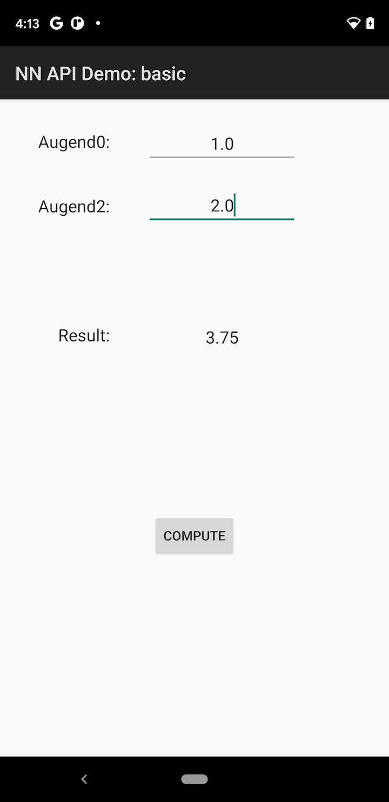

Android Neural Networks API Sample
======

The samples demonstrate how to use Android NNAPI exported through Android NDK:

- basic: showcase the main NNAPI concept from Android 8
- sequence: showcase the advanced features added in Android 11

Check each module's README.md for additional descriptions and additional requirements.

Pre-requisites
--------------
- Android Studio 4.0+.
- NDK r16+.
- Android API 27+.

Getting Started
---------------
1. [Download Android Studio](http://developer.android.com/sdk/index.html)
1. Launch Android Studio.
1. Open the sample directory.
1. Click *Tools/Android/Sync Project with Gradle Files*.
1. Click *Run/Run 'app'*.

Screenshots
-----------

Support
-------
If you've found an error in these samples, please [file an issue](https://github.com/android/ndk-samples/issues/new).

Patches are encouraged, and may be submitted by [forking this project](https://github.com/android/ndk-samples/fork) and
submitting a pull request through GitHub. Please see [CONTRIBUTING.md](../CONTRIBUTING.md) for more details.

- [Stack Overflow](http://stackoverflow.com/questions/tagged/android-ndk)
- [Android Tools Feedbacks](http://tools.android.com/feedback)

License
-------
Copyright 2020 Google LLC

Licensed to the Apache Software Foundation (ASF) under one or more contributor
license agreements.  See the NOTICE file distributed with this work for
additional information regarding copyright ownership.  The ASF licenses this
file to you under the Apache License, Version 2.0 (the "License"); you may not
use this file except in compliance with the License.  You may obtain a copy of
the License at

  http://www.apache.org/licenses/LICENSE-2.0

Unless required by applicable law or agreed to in writing, software
distributed under the License is distributed on an "AS IS" BASIS, WITHOUT
WARRANTIES OR CONDITIONS OF ANY KIND, either express or implied.  See the
License for the specific language governing permissions and limitations under
the License.
