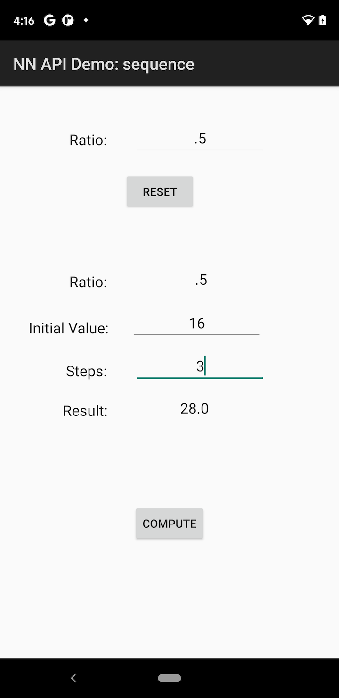

Android Neural Networks API Sample: Sequence
======
Android Neural Networks API (NN API) Sample demonstrates basic usages of NN API with a sequence model that consists of two operations: one addition and one multiplication. This graph is used for computing a single step of accumulating a geometric progression.

```
  sumIn ---+
           +--- ADD ---> sumOut
stateIn ---+
           +--- MUL ---> stateOut
  ratio ---+
```

The ratio is a constant tensor, defined in the model. It represents the weights that would have been learned during a training process. The sumIn and stateIn are input tensors. Their values will be provided when we execute the model. These values can change from execution to execution. To compute the sum of a geometric progression, the graph will be executed multiple times with inputs and outputs chained together.

```
                +----------+   +----------+         +----------+
  initialSum -->| Simple   |-->| Simple   |-->   -->| Simple   |--> sumOut
                | Sequence |   | Sequence |   ...   | Sequence |
initialState -->| Model    |-->| Model    |-->   -->| Model    |--> stateOut
                +----------+   +----------+         +----------+
```

Additional Requirements
-----------------------
- Android 11 SDK to compile
- A device running Android 11

Note: This sample uses its own wrapper to access new NNAPI features in Android 11 due to an known issue. This will be updated after the issue is fixed with the next R SDK release.

Screenshots
-----------

