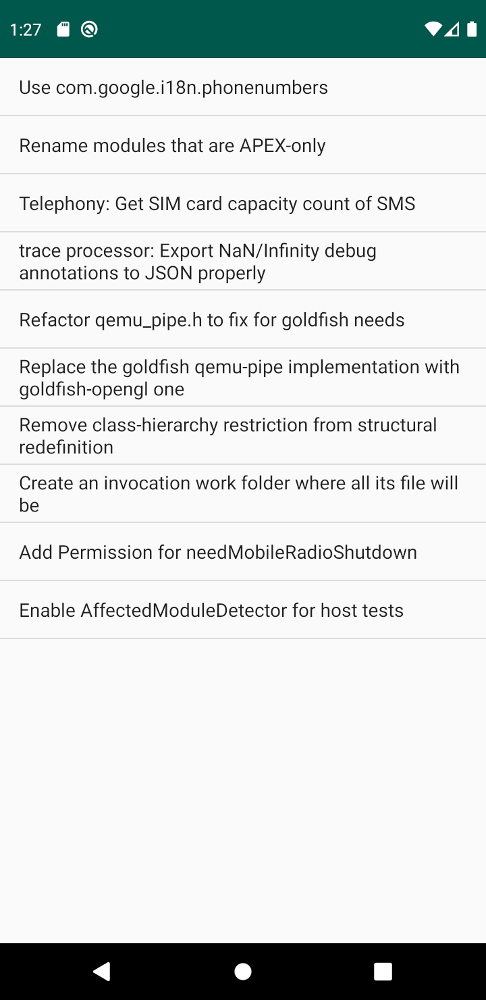

curl-ssl
========

This sample shows how to import [curl] and [OpenSSL] from Google Maven
to display a list of the most recent 10 reviews submitted to AOSP's code review system.

One of the goals is demonstrate how to handle HTTPS certificates correctly as explained by [this Stack Overflow
post](https://stackoverflow.com/a/30430033/632035): the root certificates
presented by Android since ICS are not in the format OpenSSL expects, so we need
to provide our own certificate file. We do this by downloading curl's cacert.pem
and storing that in our assets directory, as described in [this Stack Overflow
post](https://stackoverflow.com/a/31521185/632035).

If you want to understand how to use C/C++ dependencies with AGP, refer to:
* [prefab-dependency] and [prefab-publishing] samples in the same directory as this one
* [C/C++ dependencies] page for Android documentation for C/C++ dependencies

[Prefab]:https://google.github.io/prefab/
[prefab-dependency]:https://github.com/android/ndk-samples/blob/main/prefab/prefab-dependency
[prefab-publishing]:https://github.com/android/ndk-samples/blob/main/prefab/prefab-publishing
[curl]: https://curl.haxx.se/  
[OpenSSL]: https://www.openssl.org/  
[JsonCpp]: https://github.com/open-source-parsers/jsoncpp
[C/C++ dependencies]:https://developer.android.com/studio/build/native-dependencies?buildsystem=cmake&agpversion=4.0

Pre-requisites
--------------

* Android Gradle Plugin 4.0+
* The [Android NDK](https://developer.android.com/ndk/).

Getting Started
---------------

The C++ code in this sample can be built with either CMake (the default for this
project) or ndk-build. To use ndk-build set the `ndkBuild` project property
either in your `local.properties` file or on the command line by passing the
`-PndkBuild` flag when building.

To build with [Android Studio](http://developer.android.com/sdk/index.html):

1. Open this project in Android Studio.
2. Click *Run/Run 'app'*.  If you want to debug/trace code, due to [the SSL lib's known issue with lldb](https://github.com/android/ndk-samples/issues/740), make sure to apply the recommendations there for a smooth debugging experience.

To build from the command line:

1. Navigate to this directory in your terminal.
2. Run `./gradlew installDebug` (or `gradlew.bat installDebug` on Windows).

Screenshots
------------

Support
--------

If you've found an error in these samples, please [file an
issue](https://github.com/android/ndk-samples/issues/new).

Patches are encouraged, and may be submitted by submitting a pull request
through GitHub. Please see [CONTRIBUTING.md](../../CONTRIBUTING.md) for more
details.
