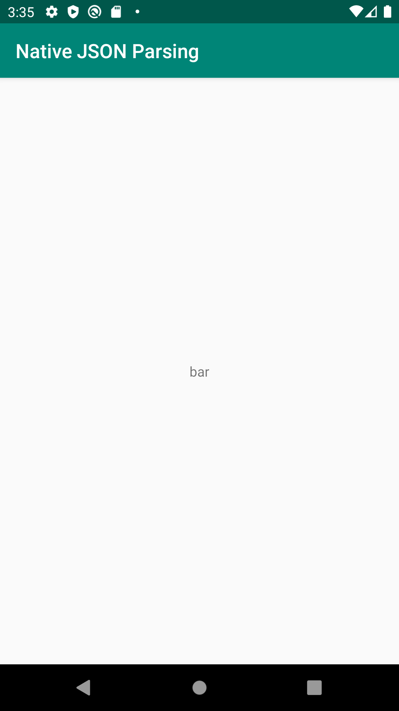

# json-parse

The json-parse sample shows how to import native dependencies from Maven. This
sample uses [JsonCpp] to extract a value from a JSON string passed from Kotlin
to C++.

[JsonCpp]: https://github.com/open-source-parsers/jsoncpp

## Pre-requisites

* Android Gradle Plugin 4.0+
* The [Android NDK](https://developer.android.com/ndk/).

## Getting Started

The C++ code in this sample can be built with either CMake (the default for this
project) or ndk-build. To use ndk-build set the `ndkBuild` project property
either in your `local.properties` file or on the command line by passing the
`-PndkBuild` flag when building.

To build with [Android Studio](http://developer.android.com/sdk/index.html):

1. Open this project in Android Studio.
2. Click *Run/Run 'app'.

To build from the command line:

1. Navigate to this directory in your terminal.
2. Run `./gradlew installDebug` (or `gradlew.bat installDebug` on Windows).

## Screenshots

## Support

If you've found an error in these samples, please [file an
issue](https://github.com/android/ndk-samples/issues/new).

Patches are encouraged, and may be submitted by submitting a pull request
through GitHub. Please see [CONTRIBUTING.md](../../CONTRIBUTING.md) for more
details.
