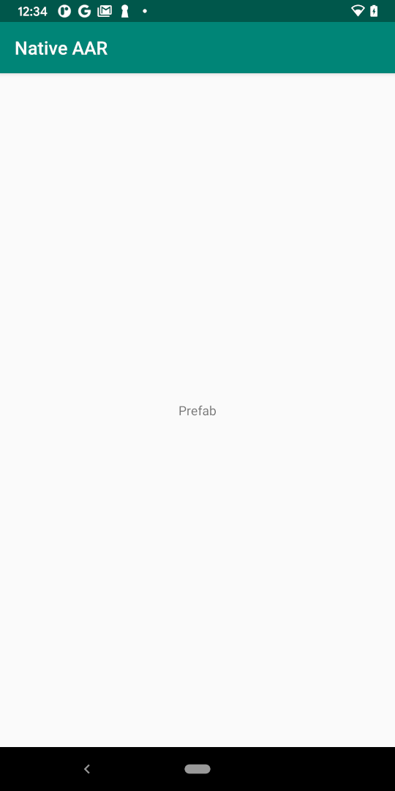

prefab-dependency
==================

C/C++ dependencies are C/C++ libraries packed with [Prefab] format into an AAR.
This sample shows how to import [JsonCPP] AAR, one example of [C/C++ dependencies], from Google Maven to an Android project.

[Prefab] could be enabled from Android Gradle Plugin 4.0+. In order to use the feature, follow these 3 steps:

* Enable the prefab feature in [gradle.properties]. **Note** that in 4.1+, this needs to be
  done with `android.buildFeatures.prefab=true` in the module's `build.gradle` file, for example `app/build.gradle`.
* Declare the dependencies in the app module's [build.gradle] in the same way you as would do with Kotlin/Java
  dependencies.
* Add the dependencies into the native module's [Android.mk] or [CMakeLists.txt]

From here on, the [headers] and [libraries] in the dependencies are available for your native build system!

If you want to understand more about C/C++ dependency AARs, go to [C/C++ dependencies] page for 
Android Prefab official documentation.

[C/C++ dependencies]:https://developer.android.com/studio/build/native-dependencies?buildsystem=cmake&agpversion=4.0
[Prefab]:https://google.github.io/prefab/
[AGP]:https://google.github.io/android-gradle-dsl/current
[android-library]:https://developer.android.com/studio/projects/android-library#AddDependency
[android-dependencies]:https://developer.android.com/studio/build/dependencies
[gradle.properties]:https://github.com/android/ndk-samples/blob/main/prefab/prefab-dependency/gradle.properties#L22
[build.gradle]:https://github.com/android/ndk-samples/blob/main/prefab/prefab-dependency/app/build.gradle#L65
[android.mk]:https://github.com/android/ndk-samples/blob/main/prefab/prefab-dependency/app/src/main/cpp/Android.mk#31
[CMakeLists.txt]:https://github.com/android/ndk-samples/blob/main/prefab/prefab-dependency/app/src/main/cpp/CMakeLists.txt#L20
[headers]:https://github.com/android/ndk-samples/blob/main/prefab/prefab-dependency/app/src/main/cpp/app.cpp#L23
[libraries]:https://github.com/android/ndk-samples/blob/main/prefab/prefab-dependency/app/src/main/cpp/CMakeLists.txt#L25
[curl]: https://curl.haxx.se/  
[OpenSSL]: https://www.openssl.org/  
[JsonCpp]: https://github.com/open-source-parsers/jsoncpp

Pre-requisites
--------------

* Android Gradle Plugin 4.0+
* The [Android NDK](https://developer.android.com/ndk/).

Getting Started
---------------

The C++ code in this sample can be built with either CMake (the default for this
project) or ndk-build. To use ndk-build set the `ndkBuild` project property
either in your `local.properties` file or on the command line by passing the
`-PndkBuild` flag when building.

To build with [Android Studio](http://developer.android.com/sdk/index.html):

1. Open this project in Android Studio.
2. Click *Run/Run 'app'*.

To build from the command line:

1. Navigate to this directory in your terminal.
2. Run `./gradlew installDebug` (or `gradlew.bat installDebug` on Windows).

Screenshots
------------

Support
--------

If you've found an error in these samples, please [file an
issue](https://github.com/android/ndk-samples/issues/new).

Patches are encouraged, and may be submitted by submitting a pull request
through GitHub. Please see [CONTRIBUTING.md](../../CONTRIBUTING.md) for more
details.
