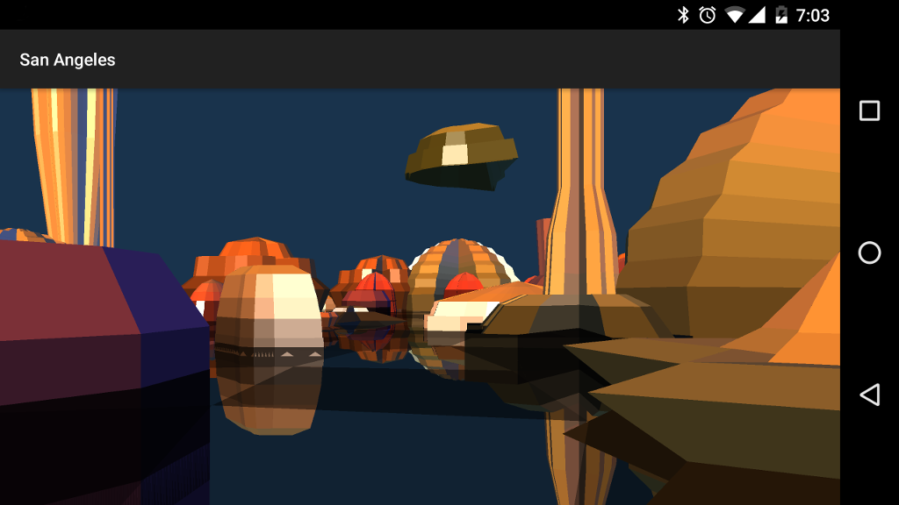

San Angeles
===========
San Angeles is an Android port of a demo that uses GLES C/API to render a procedural scene.

See the original [README](app/src/main/cpp/README.txt) for more details about the original GLES port.

The sample demos:
- [Android Studio with CMake support](http://tools.android.com/tech-docs/external-c-builds)
- [ABI APK split](http://tools.android.com/tech-docs/new-build-system/user-guide/apk-splits#TOC-ABIs-Splits)

Pre-requisites
--------------
- Android Studio 2.2+ with [NDK](https://developer.android.com/ndk/) bundle.

Getting Started
---------------
1. [Download Android Studio](http://developer.android.com/sdk/index.html)
1. Launch Android Studio.
1. Open the sample directory.
1. Open *File/Project Structure...*
  - Click *Download* or *Select NDK location*.
1. Click *Tools/Android/Sync Project with Gradle Files*.
1. Click *Run/Run 'app'*.

Screenshots
-----------

Support
-------
If you've found an error in these samples, please [file an issue](https://github.com/googlesamples/android-ndk/issues/new).

Patches are encouraged, and may be submitted by [forking this project](https://github.com/googlesamples/android-ndk/fork) and
submitting a pull request through GitHub. Please see [CONTRIBUTING.md](../CONTRIBUTING.md) for more details.

- [Stack Overflow](http://stackoverflow.com/questions/tagged/android-ndk)
- [Google+ Community](https://plus.google.com/communities/105153134372062985968)
- [Android Tools Feedbacks](http://tools.android.com/feedback)

License
-------
See the original [licensing](app/src/main/jni/license.txt) information.
