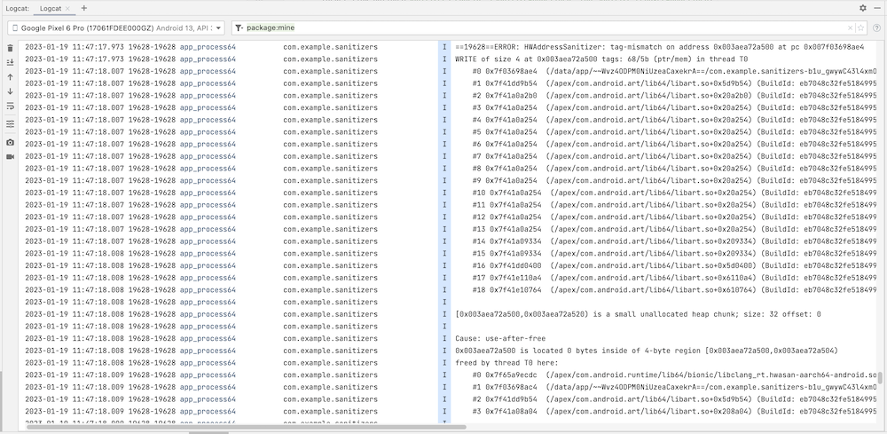
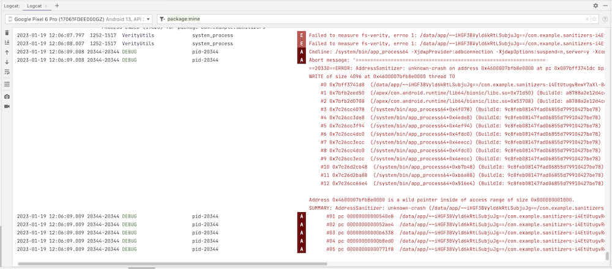
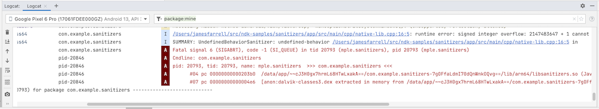

# Sanitizers

This Android sample shows how to use sanitizers to detect problems in your
native code, such as memory errors and undefined behavior.

## Build variants

Using a sanitizer requires building your app differently. Your native code must
be compiled differently, and you may need to include a runtime library and a
wrapper script.

To accomplish this, we use a different build variant for each sanitizer. You may
wish to review the
[documentation](https://developer.android.com/studio/build/build-variants) and
[codelab](https://developer.android.com/codelabs/build-variants) for build
variants.

The runtime libraries and wrapper script are included with the NDK distribution,
but it hasn't been well-documented how to use them. By using some tricks in
[CMakeLists.txt](app/src/main/cpp/CMakeLists.txt), we can automatically grab
what we need from the NDK and make it available to the build.

## Hardware-assisted Address Sanitizer (hwasan)

The recommended way to detect memory errors such as use-after-free in native
code is with hwasan. It uses special hardware features on 64-bit ARM devices,
and requires a special build of Android. It is preferable to asan (below)
because it has much less RAM overhead.

For more information, including how to flash a build of Android that supports
hwasan, refer to the Android developer
[guide](https://developer.android.com/ndk/guides/hwasan) and the
[clang documentation](https://clang.llvm.org/docs/HardwareAssistedAddressSanitizerDesign.html).

[native-lib.cpp](app/src/main/cpp/native-lib.cpp) contains a simple
use-after-free error:

```C++
int* foo = new int;
*foo = 3;
delete foo;
*foo = 4;
```

When you build and run the hwasan build variant, the sample app should
immediately crash, and the
[logcat panel](https://developer.android.com/studio/debug/logcat) in Android
Studio should contain information about the problem:



## Address Sanitizer (asan)

If you want to test on a 32-bit device, or prefer not to flash a custom build,
you can use the asan build variant instead. As described in the
[developer guide](https://developer.android.com/ndk/guides/asan), this requires
a runtime library and wrapper script, which this sample copies automatically
from the NDK distribution.

As with hwasan, the sample app should immediately crash, and you can look at the
logcat panel for information about the problem:



## Undefined Behavior Sanitizer (ubsan)

The undefined behavior sanitizer detects undefined behavior in your native code.
For more information on the types of problems it can detect, refer to the
[clang documentation](https://clang.llvm.org/docs/UndefinedBehaviorSanitizer.html).
It requires a runtime library, which the sample app copies automatically from
the NDK distribution.

[native-lib.cpp](app/src/main/cpp/native-lib.cpp) contains a signed integer
overflow error, which is undefined behavior:

```C++
int k = 0x7fffffff;
k += 1;
```

This triggers a crash when you build and run the ubsan variant, and the logcat
panel tells you what's going on:



## Support

If you've found an error in these samples, please
[file an issue](https://github.com/googlesamples/android-ndk/issues/new).

Patches are encouraged, and may be submitted by
[forking this project](https://github.com/googlesamples/android-ndk/fork) and
submitting a pull request through GitHub. Please see
[CONTRIBUTING.md](../CONTRIBUTING.md) for more details.

- [Stack Overflow](http://stackoverflow.com/questions/tagged/android-ndk)
- [Android Tools Feedbacks](http://tools.android.com/feedback)

## License

Copyright 2022 Google, Inc.

Licensed to the Apache Software Foundation (ASF) under one or more contributor
license agreements. See the NOTICE file distributed with this work for
additional information regarding copyright ownership. The ASF licenses this file
to you under the Apache License, Version 2.0 (the "License"); you may not use
this file except in compliance with the License. You may obtain a copy of the
License at

http://www.apache.org/licenses/LICENSE-2.0

Unless required by applicable law or agreed to in writing, software distributed
under the License is distributed on an "AS IS" BASIS, WITHOUT WARRANTIES OR
CONDITIONS OF ANY KIND, either express or implied. See the License for the
specific language governing permissions and limitations under the License.
