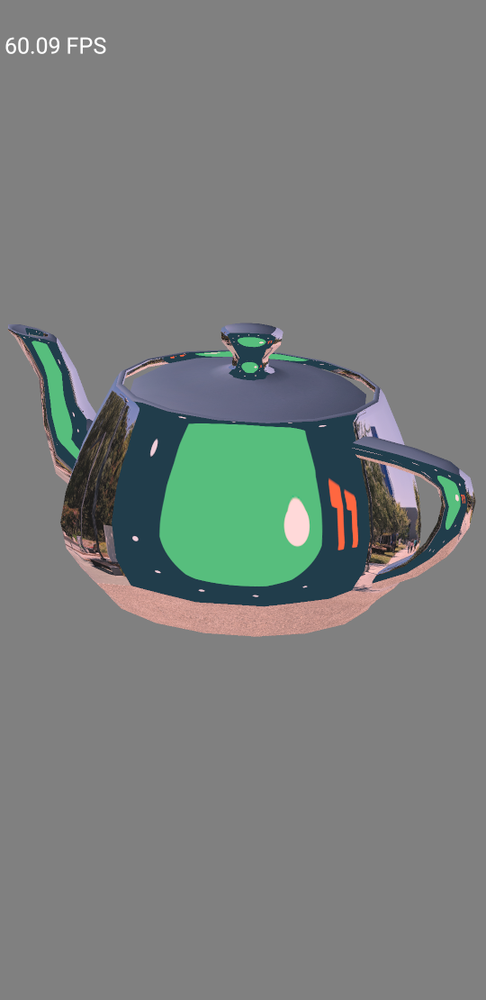

image-decoder
==============
This sample demonstrates the [ImageDecoder](https://developer.android.com/ndk/guides/image-decoder) functionality added to Android 11:
- Texture files are decoded with AImageDecoder
- The rest of the code is the same as that of TexturedTeapot
This sample needs to be build with NDK 21.1 available from the canary channel, Android Studio 4.0+ would prompt you to install the needed NDK; in case you meet difficulties, check out
[NDK configuration documentation](https://github.com/android/ndk-samples/wiki/Configure-NDK-Path) to fix local issues.

Screenshots
-----------

