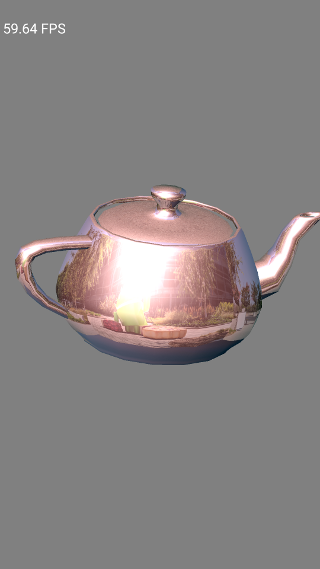

textured-teapot
==============
This sample is a simple enhancement with a texture for classic-teapot
- The teapot vertex coordinators are part of the model files
- CPU side of the code for texturing is in TexturedTeapotRender class
- fragment shader simply textures in and blend
- Texture files are under apk's assets/Textures folder(bmp & tga tested)
- Renders plain, 2d textured, and cubemap textured teapots, refer to
  TexturedTeapotRender::GetTextureType()

Screenshots
-----------

